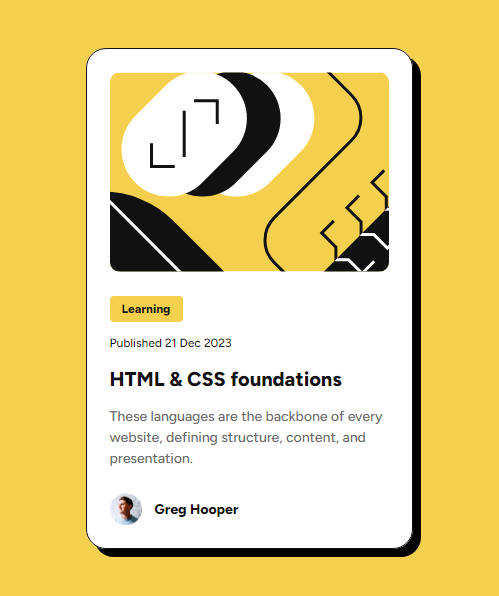
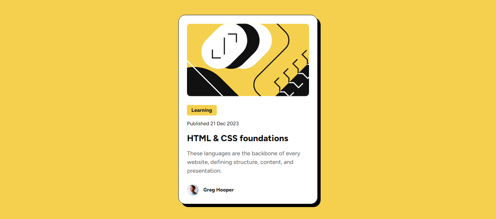

# Frontend Mentor - Blog preview card solution

This is a solution to the [Blog preview card challenge on Frontend Mentor](https://www.frontendmentor.io/challenges/blog-preview-card-ckPaj01IcS). Frontend Mentor challenges help you improve your coding skills by building realistic projects.

## Table of contents

- [Overview](#overview)
  - [The challenge](#the-challenge)
  - [Screenshot](#screenshot)
  - [Links](#links)
- [My process](#my-process)
  - [Built with](#built-with)
  - [What I learned](#what-i-learned)
- [Author](#author)

**Note: Delete this note and update the table of contents based on what sections you keep.**

## Overview

### The challenge

Users should be able to:

- See hover and focus states for all interactive elements on the page

### Screenshot

### Links

- Solution URL: [Frontend Mentor solution](https://www.frontendmentor.io/solutions/responsive-blog-preview-card-ZlixLKI527)
- Live Site URL: [Live site](https://your-live-site-url.com)

## My process

### Built with

- Semantic HTML5 markup
- CSS custom properties
- Flexbox
- Mobile-first workflow

### What I learned

Throughout the development of this project, I gained proficiency in implementing media queries to achieve responsive web design, ensuring the layout adapts effectively across different screen sizes. Additionally, I expanded my knowledge of advanced CSS properties, including the use of object-fit to control how images are displayed within containers when their dimensions differ. I also explored the outline and outline-offset properties, leveraging them to create inner borders without affecting the layout. Furthermore, I deepened my understanding of CSS inheritance, enhancing my ability to manage cascading styles efficiently.

## Author

- LinkedIn - [@NelsonMontesinos](www.linkedin.com/in/njmontesinos)
- Frontend Mentor - [@Daydream-Softworks](https://www.frontendmentor.io/profile/Daydream-Softworks)
